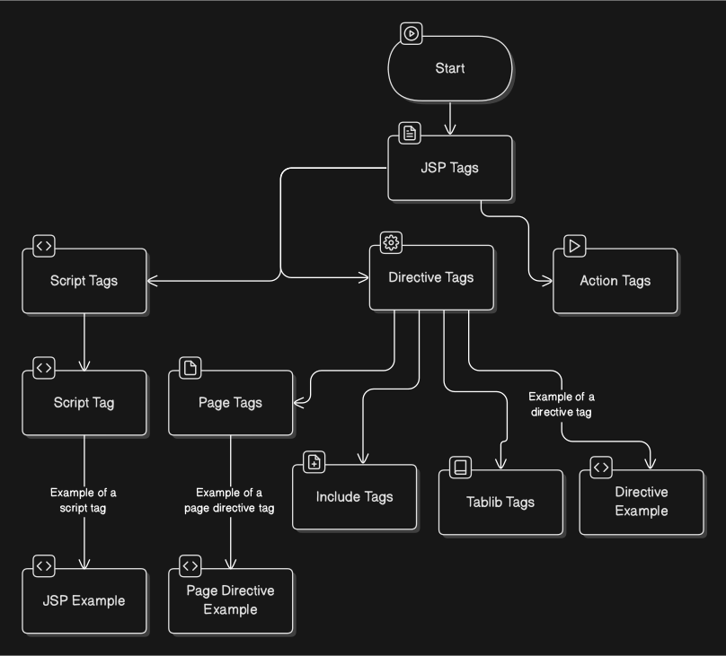

# JSP (JavaServer Pages)

## What is JSP?
JSP (JavaServer Pages) is a server-side technology used to create dynamic, platform-independent web applications. It allows embedding Java code directly into HTML pages using special JSP tags. JSP is part of the Java EE (Enterprise Edition) platform.

It is typically used for building presentation layers in web applications, meaning it is mostly used for generating HTML content based on backend logic.

---

## Comparison Example: ASP vs JSP

### Example of ASP.NET syntax:
```html
<html>
    <head></head>
    <body>
        <asp:form></asp:form>
    </body>
</html>
```

**ASP.NET** is a Microsoft technology. On the other hand, **JSP** is Java-based. A simple **JSP** page looks like this:

```jsp
<%@ page language="java" contentType="text/html; charset=UTF-8" %>
<html>
    <head><title>Hello JSP</title></head>
    <body>
        <h2>Hello, today is: <%= new java.util.Date() %></h2>
    </body>
</html>
```

Here, `<%= ... %>` is a **JSP expression** that outputs the result directly into the HTML.

---

## Relationship Between JSP and Servlets

- **JSP runs on top of Java Servlets.**
- Internally, the JSP file is converted into a **Java Servlet** by the JSP container.
- This servlet is then compiled into a `.class` file and executed by the servlet container (e.g., Apache Tomcat).

So, a **JSP page is essentially a high-level abstraction of a Java Servlet** that is easier to write and maintain.

---

## Requirements to Run JSP
To run a JSP page, you need:

1. **A Web Server** (like Apache Tomcat)  
2. **JSP Container** (part of most Java web servers)  
   - This container translates and compiles the JSP into a servlet.
   - It handles the lifecycle of JSP pages.

```
Web Server
    └── JSP Container
            ├── Translates JSP → Servlet
            ├── Compiles Servlet
            ├── Executes Servlet
```

---

## Lifecycle of a JSP Page

The JSP lifecycle is similar to a servlet lifecycle but has additional steps:

1. ### Translation (JSP → Servlet)
   - The JSP engine converts the `.jsp` file into a Java servlet source file (`.java`).

2. ### Compilation
   - The servlet source is compiled into a `.class` file (Java bytecode).

3. ### Initialization
   - The container initializes the servlet using the `jspInit()` method (called only once).

4. ### Request Processing / Execution
   - For each client request, the `jspService()` method is called.
   - This method handles the HTTP request and sends the response.

5. ### Destruction
   - When the server shuts down or the JSP is no longer needed, `jspDestroy()` is called to release resources.

Diagrammatically:
```
JSP Page
   ↓
Translation
   ↓
Java Servlet
   ↓
Compilation
   ↓
Bytecode (.class)
   ↓
Initialization (jspInit)
   ↓
Execution (jspService)
   ↓
Destruction (jspDestroy)
```

---

## Types of JSP Scripting Elements

1. **Declarations `<%! ... %>`**  
   Declare variables and methods used in the JSP.

2. **Scriptlets `<% ... %>`**  
   Embed Java code that gets executed when the page is requested.

3. **Expressions `<%= ... %>`**  
   Output values directly into the HTML response.

---

## Advantages of JSP

- Easy to write: Mix of HTML and Java.
- Automatically compiled to Servlets.
- Supports MVC architecture when used with Servlets/Beans.
- Reusable JavaBeans can be integrated.
- Platform-independent.

---

## Disadvantages of JSP

- Mixing Java code with HTML can get messy.
- Not suitable for complex business logic (should delegate to Java classes).
- Requires a servlet container to run (like Tomcat).

---

## 🔄 JSP + Servlet MVC Example

### 🎯 Objective:
A user enters their name into a form (View), a Servlet processes it (Controller), and the result is shown on another JSP page.

---

### 📁 Project Structure

```
MyWebApp/
├── index.jsp              ← View: Form for user input
├── WelcomeServlet.java    ← Controller: Processes request
├── welcome.jsp            ← View: Shows result
└── WEB-INF/
    └── web.xml            ← Deployment descriptor
```

---

### 🗾️ 1. `index.jsp` (View – Form)

```jsp
<%@ page contentType="text/html;charset=UTF-8" %>
<html>
<head><title>Welcome Form</title></head>
<body>
    <h2>Enter your name:</h2>
    <form action="WelcomeServlet" method="post">
        Name: <input type="text" name="username" />
        <input type="submit" value="Submit" />
    </form>
</body>
</html>
```

---

### ⚙️ 2. `WelcomeServlet.java` (Controller)

```java
import java.io.*;
import javax.servlet.*;
import javax.servlet.http.*;

public class WelcomeServlet extends HttpServlet {
    protected void doPost(HttpServletRequest request, HttpServletResponse response)
            throws ServletException, IOException {
        String name = request.getParameter("username");

        // Set name as request attribute
        request.setAttribute("user", name);

        // Forward to JSP (View)
        RequestDispatcher dispatcher = request.getRequestDispatcher("welcome.jsp");
        dispatcher.forward(request, response);
    }
}
```

---

### 📄 3. `welcome.jsp` (View – Display Result)

```jsp
<%@ page contentType="text/html;charset=UTF-8" %>
<html>
<head><title>Welcome</title></head>
<body>
    <h2>Hello, <%= request.getAttribute("user") %>! Welcome to JSP MVC Example.</h2>
</body>
</html>
```

---

### 💠 4. `web.xml` (Servlet Configuration)

```xml
<web-app>
    <servlet>
        <servlet-name>WelcomeServlet</servlet-name>
        <servlet-class>WelcomeServlet</servlet-class>
    </servlet>
    <servlet-mapping>
        <servlet-name>WelcomeServlet</servlet-name>
        <url-pattern>/WelcomeServlet</url-pattern>
    </servlet-mapping>
</web-app>
```

---

### ✅ Flow Summary:
1. **User fills the form** on `index.jsp`.
2. The form data is **sent to `WelcomeServlet`** using POST.
3. Servlet **processes the data** and forwards it to `welcome.jsp`.
4. `welcome.jsp` **displays the personalized message**.

---

# 7 April 2025

Examples:-
```jsp
<html>
   <head></head>
   <body>
      <!-- Declaration Tag -->
      <%! int data = 50;  %>
      <!-- Expression tag -->
      <% ="value of data= "+ data; %>
      <!-- We can also declare method inside declaration tag -->
      <%!
         int cube(int a){
            return a*a*a;
         }
      %>
   </body>
</html>
```

Implicit Objects
```
Out         PageContent
request     Page 
response    Exception
config 
application
```
Rules to use implicit objects

# 11-April-2025


```jsp
<%@ page contentType="text/html" pageEncoding="UTF-8" import="java.util.Random" %>

<html>
<head>
    <title>Random Number Generator</title>
</head>
<body>
    Random Number: 
    <%
        Random r = new Random();
        int num = r.nextInt(100); // Generates a number between 0 and 99
        out.print(num);
    %>
</body>
</html>

```

header.jsp
```jsp
<h1 style="
    background-color: blue;
    color: white;
    padding: 5px;
">
    Random Number
</h1>

```
If we want to add header from header.jsp file we do the following:

```jsp
<%@ page contentType="text/html" pageEncoding="UTF-8" %>
<%@ page import="java.util.Random" %>

<html>
<head>
    <title>Random Number Generator</title>
</head>
<body>

    <%@ include file="header.jsp" %>

    <%
        Random r = new Random();
        int num = r.nextInt(100); // Generates number between 0 and 99
        out.print("Random Number: " + num);
    %>

</body>
</html>
```
Taglib Usecase:
```jsp
<%@ page contentType="text/html" pageEncoding="UTF-8" %>
<%@ taglib prefix="c" uri="http://java.sun.com/jsp/jstl/core" %>

<!DOCTYPE html>
<html>
<head>
    <title>Using JSTL</title>
</head>
<body>

    <c:set var="name" value="Ravi" />
    <p>Hello, <c:out value="${name}" /></p>

</body>
</html>

```

JSTL uses
```jsp
<%@ page contentType="text/html" pageEncoding="UTF-8" %>
<%@ taglib prefix="c" uri="http://java.sun.com/jsp/jstl/core" %>
<%@ taglib prefix="fmt" uri="http://java.sun.com/jsp/jstl/fmt" %>

<!DOCTYPE html>
<html>
<head>
    <title>JSTL Examples</title>
</head>
<body>

    <!-- 1. Setting and Outputting a Variable -->
    <c:set var="name" value="Alice" />
    <p>Hello, <c:out value="${name}" /></p>

    <!-- 2. Conditional Rendering -->
    <c:set var="age" value="20" />
    <c:if test="${age >= 18}">
        <p>You are eligible to vote.</p>
    </c:if>

    <!-- 3. Looping from 1 to 5 -->
    <p>Numbers from 1 to 5:</p>
    <c:forEach var="i" begin="1" end="5">
        ${i} 
    </c:forEach>

    <!-- 4. Choose/When/Otherwise -->
    <c:set var="score" value="85" />
    <p>
        <c:choose>
            <c:when test="${score >= 90}">Grade: A</c:when>
            <c:when test="${score >= 80}">Grade: B</c:when>
            <c:otherwise>Grade: C or below</c:otherwise>
        </c:choose>
    </p>

    <!-- 5. Formatting Date -->
    <jsp:useBean id="now" class="java.util.Date" />
    <p>Today's Date: <fmt:formatDate value="${now}" pattern="dd-MM-yyyy" /></p>

</body>
</html>

```

